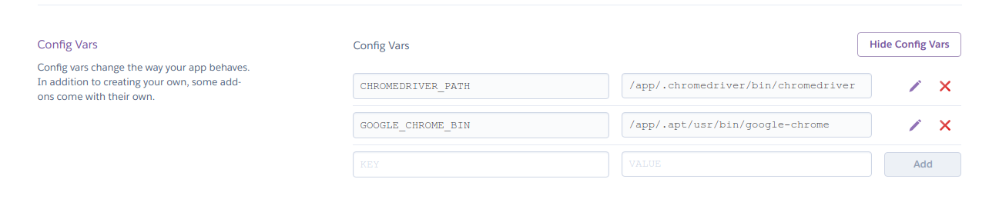
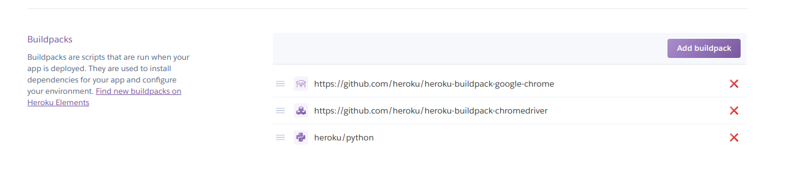

# Selenium-Heroku-Python-POC
A simple Amazon Web Scraper proof of concept using Selenium inside a Python application and deployed on Heroku


## Local setup
If you fork this repo and try to run ```python scraper.py``` most probably you  
will get this error:

```
FileNotFoundError: [Errno 2] No such file or directory: '/usr/local/bin/chromedriver': '/usr/local/bin/chromedriver'

selenium.common.exceptions.WebDriverException: Message: 'chromedriver' executable needs to be in PATH. Please see https://sites.google.com/a/chromium.org/chromedriver/home
```

That is because you have no installed 'chromedriver'

You require Google Chrome installed and the chromedriver for the same version of your chrome browser  

i.e. if you have Google Chrome 73.XXX.XX you will need chromedriver 73

| Navegador | Web driver |
| --------- | ---------  |
| Chrome    | https://sites.google.com/a/chromium.org/chromedriver/downloads |

There're more drivers for other browsers such as Firefox and Safari
Reference https://swethatanamala.github.io/2018/09/01/web-scraping-using-python-selenium-and-beautiful-soup/


## Heroku requirements (only for deployment)
#### Environment variables
CHROMEDRIVER_PATH = /app/.chromedriver/bin/chromedriver  
GOOGLE_CHROME_BIN = /app/.apt/usr/bin/google-chrome



#### Buildpacks
You will need to install Google Chrome on heroku, so you need to add this custom buildpack:  
https://github.com/heroku/heroku-buildpack-google-chrome  

Furthermore you will need the chromedrivre package for selenium  
https://github.com/heroku/heroku-buildpack-chromedriver




Source: https://stackoverflow.com/questions/41059144/running-chromedriver-with-python-selenium-on-heroku
